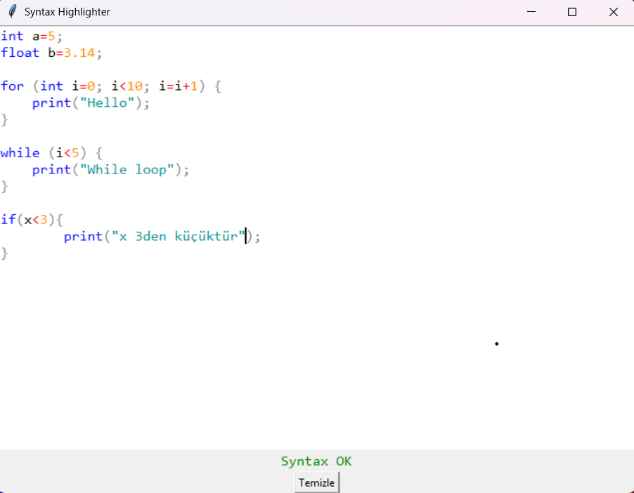
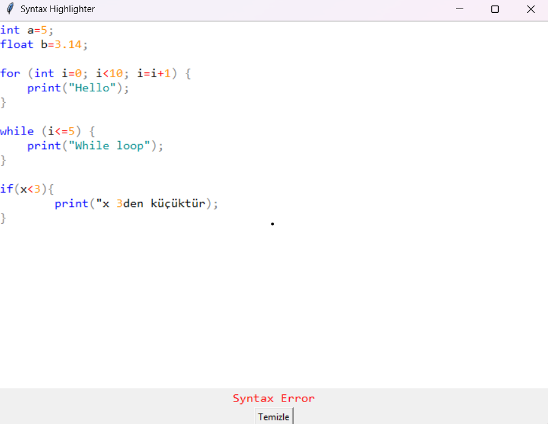

# Syntax-Highlighter
Bu proje, Python ve içerisindeki Tkinter kütüphanesi kullanılarak yapılmış basit bir **Syntax Highlighter** ve **Parser** uygulamasıdır.  
Kullanıcı tarafından girilen basit programlama diline ait kodları **renklendirir** ve **söz dizimi (syntax) hatalarını** kontrol eder.

## Özellikler
- Temel programlama yapıları(C dili) için lexer(token ayırma işlemi) ve parser(sentaks analizi)  
- `print`,`if-else`,`while`,`for`, gibi temel kontrol yapıları  
- `int`, `float`, `double` gibi veri tipleri ve değişken tanımlama  
- Çoğu programlama dilinde kullanılan temel operatörler
- Atama işlemi
- Fonksiyon bildirimleri ve tek statement'lı fonksiyon gövdeleri  
- Tkinter ile oluşturulmuş kullanıcı arayüzü  
- Kod yazarken gerçek zamanlı syntax kontrolü ve renkli token vurgulama  
- Basit hata mesajları ve "Syntax OK" veya "Syntax Error" göstergesi

## Doğru çalışan kodda GUI ekranı
  

-------------------------------------------------------------------------------------  

## Yanlış çalışan kodda GUI ekranı
- Buradaki örnekte print ifadesi içerisindeki " unutulduğundan gui ekranında bize "Syntax Error" yazmaktadır.  
  

## Kullanılan Teknolojiler
- python 3.x  
- Tkinter – Python'un yerleşik GUI (grafiksel kullanıcı arayüzü) kütüphanesi.  
- re (Regular Expressions) – Sözcüksel analiz (lexer) işlemleri için düzenli ifadeler kullanılmıştır.  

## Mevcut Problemler ve Eksiklikler 
- Fonksiyon,if-else bloğu,for döngüsü ve while döngüsü yapılarında gövdede yalnızca tek statement destekliyor.
- Yalnızca tek satırlı yorum satırlarını algılayabiliyor.

## Kurulum
1.Python 3.x sisteminize kurulu değilse python.org adresinden indirip kurun.  
2.Bu projeyi yerel makinenize indirin ya da klonlayın
3.Terminal veya komut istemcisinde çalıştırın veya indirdiğiniz dosyayı bilgisayarınızda kullandığınız bir ide ile açıp main.py dosyasını çalıştırın.  

## Rapor
[Syntax Highlighter Proje Final Raporunu Buradan Görebilirsiniz](./final_rapor.pdf)

## Demo Video
[Projenin çalışma videosunu buradan izleyebilirsiniz](https://www.youtube.com/watch?v=Y1HQZ_E6YX8) 
